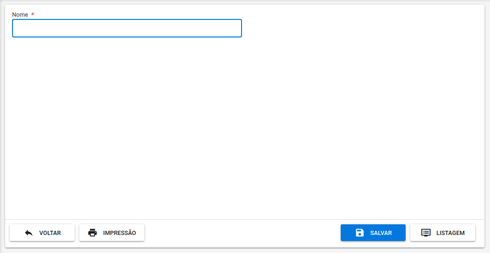
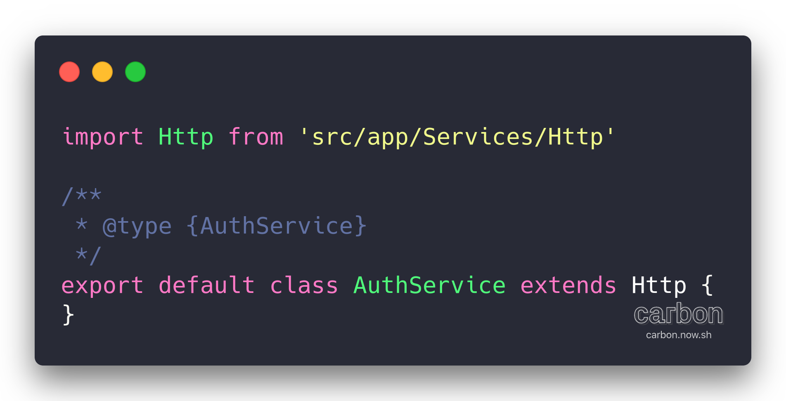

# Starting with the Skeleton

## Start development mode

To run the project we can use the [Quasar Cli](https://quasar.dev/quasar-cli/cli-documentation/commands-list#dev) or [Docker](https://docs.docker.com/install). All two are via command line with the terminal open in the project's root folder.

### Quasar CLI

If you already have the [Quasar Cli](https://quasar.dev/quasar-cli/cli-documentation/commands-list#dev) properly installed in your environment, we can use the command below to start the development mode

```bash
quasar dev
```

### Docker Compose

If your workstation has [Docker](https://docs.docker.com/install) + [Docker Compose](https://docs.docker.com/compose/install), you can use docker-compose to start development mode using

```bash
cp docker-compose.yml.develop cp docker-compose.yml
docker-compose up
```

### Command Status

Wait until you see an exit at the terminal like the one in the image below. At this point your project will be ready to start work.



## Starting the jobs

Access the URL address of your browser at the URL [`http://localhost:8080`](http://localhost:8080) and check if something like the image below appears.



After the installation is done and we put the project into development mode, we will implement a new feature. The resource that will be created will be a simple Category register. The class name for this register will be `Category` \(just to accompany the rest of the code that is in English\), which could be used in a real scenario to categorize any other register. Use the link below to proceed to the next step.


The example will use the `Category` entity as a reference from now on, but feel free to create what’s cool for you




