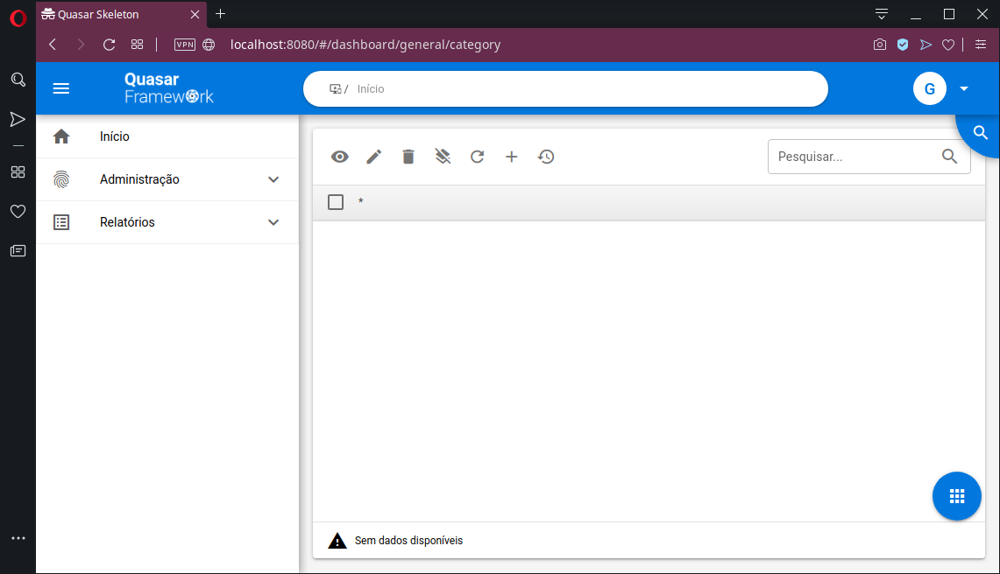
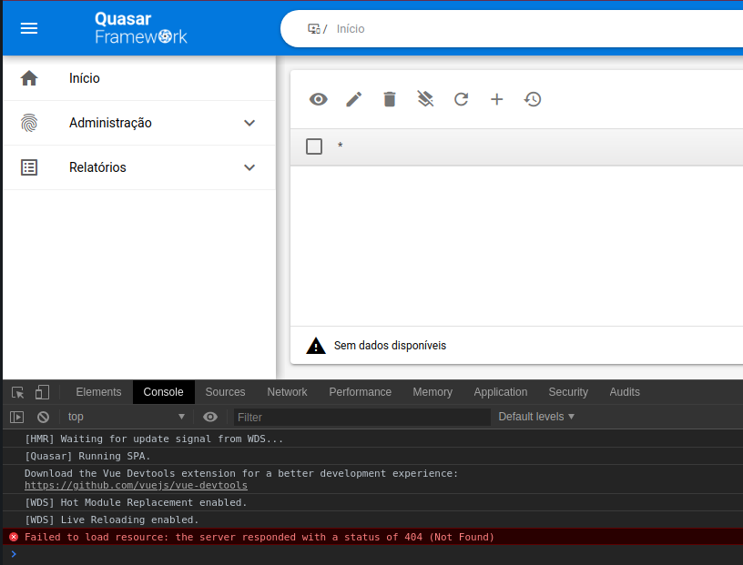
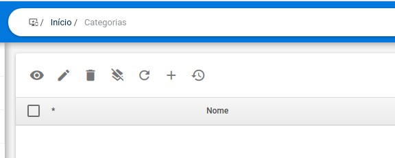
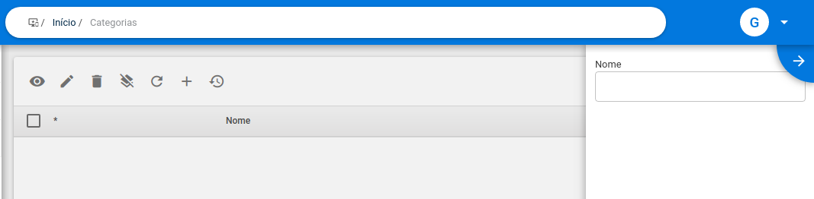
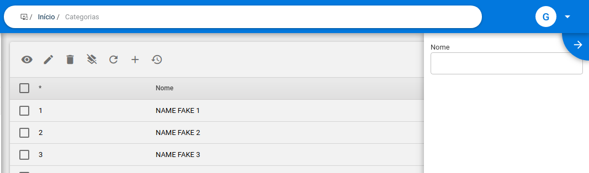
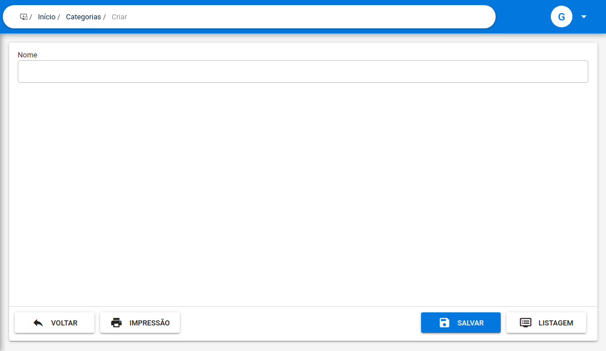
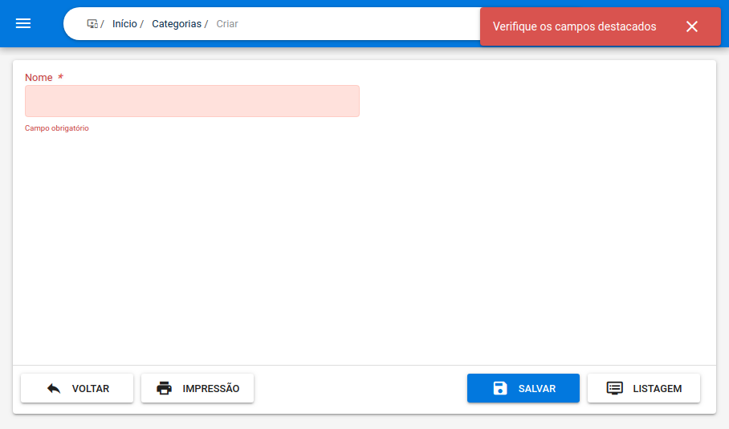
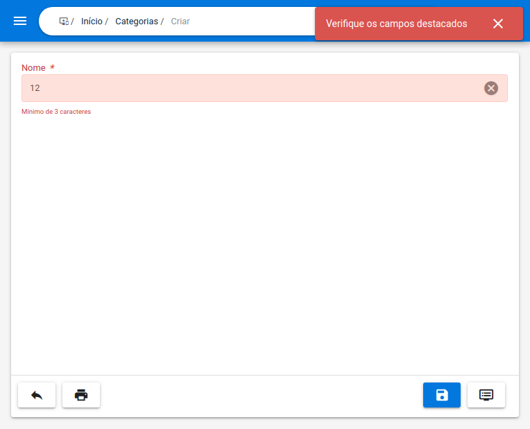

# Working with the screens

## Accessing the screens

If we access [`http://localhost:8080/#/dashboard/general/category`](http://localhost:8080/#/dashboard/general/category) it will be possible to see the screen that displays the`Category`entity`table`that we created \(assuming that no changes were made to what comes by default in the project\). Below is an image of the result that can be seen after opening the link above.



As we can see, the screen was empty and an error was generated on the console.



The screen is empty because our field is still visible in the`table`\(in addition to not having a defined`label`\) and we don't have an`API`to be consumed. We will see how to improve this in the following topics.

It is possible to notice that several resources are already created by default, buttons, search field and an advanced side search comes by default when we create a`table`using the component that is built into the project. Below we will see details about them. If you still have questions, go to the [Concepts](../como-utilizar/) section.

## Configuring the `schema`

The`schemes`are structures that have several resources to be configured, we will configure some below. To see all the`schema`settings go to the [Schema](../como-utilizar/schema.md) page.

### Internationalization Archive

To load the texts from the fields, isolated files are used with the messages to be written. Create a file named`pt-br.js` in the domain folder \(`src/domains/General/Category/pt-br.js`\) with the necessary basic messages. Note that we are using a property called`SCOPES`to define some properties, see more about it [here](../como-utilizar/scopes-e-positions.md).


```javascript
import { SCOPES } from 'src/app/Agnostic/enum'

/**
 */
export default {
  routes: {
    group: {
      crumb: 'Categorias'
    },
    [SCOPES.SCOPE_INDEX]: {
      title: 'Categorias'
    },
    [SCOPES.SCOPE_TRASH]: {
      title: 'Lixeira das Categorias',
      crumb: 'Lixeira'
    },
    [SCOPES.SCOPE_ADD]: {
      title: 'Criar Categoria',
      crumb: 'Criar'
    },
    [SCOPES.SCOPE_VIEW]: {
      title: 'Visualizar Categoria',
      crumb: 'Visualizar'
    },
    [SCOPES.SCOPE_EDIT]: {
      title: 'Editar Categoria',
      crumb: 'Editar'
    }
  },
  print: {
    title: 'Impressão de Categoria'
  },
  fields: {
    name: 'Nome'
  }
}
```


We are using this name because of the configuration that is in`.env`.

```bash
# the messages group of language to use
VUE_APP_LOCALE="pt-br"
```

After creating the file we need to register it in the message file in the`lang/` directory. For that we can access`src/lang/pt-br/domains.js` and add it there. The result will look something like the excerpt below.


```javascript
// ...

// domain/General
import category from 'src/domains/General/Category/pt-br'

// ...

/**
 */
export default {
  // ...
  general: {
    category
  },
  // ...
}
```


### Working with the`table`

As seen above, the table listing Category records is available at the URL [`http://localhost:8080/#/dashboard/general/category`](http://localhost:8080/#/dashboard/general/category).

To display a field in the`table`, we can call the`fieldTableShow`method.


```javascript
 // ...
   /**
   * Configure schema
   */
   construct () {
    this.addField('name')
      .fieldTableShow()
   }
 // ...
```


With the internationalization defined and the field configured to be visible, we can see that the application screen now shows the "Name" field.



The table has an area for advanced search, to put the field to appear in this area we can use the`fieldTableWhere`method.


```javascript
// ...
   /**
   * Configure schema
   */
   construct () {
    this.addField('name')
      .fieldTableShow()
      .fieldTableWhere()
   }
 // ...
```


The result will be something like the image below.



To simulate a data set in the`table`, we can modify the`CategoryService`to generate`fake`data. Below is an example of what an override of the`paginate`method would look like to generate data to show false data and popularize the list of records. In a real environment, the`fetch records` system is adapted to deal with the responses of the API that is consumed.


```javascript
import Rest from 'src/app/Services/Rest'
import { resource } from 'src/domains/General/Category/settings'
import { get, uuid, promisify } from 'src/app/Util/general'

/**
 * @class {CategoryService}
 */
export default class CategoryService extends Rest {
  /**
   * @type {string}
   */
  resource = resource

  /**
   * @param {Record<string, string | number>} parameters
   * @param {Array<string>} [filters] = []
   * @param {boolean} [trash] = false
   * @returns {Promise<any>}
   */
  paginate (parameters, filters, trash = false) {
    const { pagination } = parameters

    const rowsPerPage = get(pagination, 'rowsPerPage', this.size)
    const sortBy = get(pagination, 'sortBy')
    const descending = get(pagination, 'descending')
    const page = get(pagination, 'page', 1)

    const rowsNumber = 32
    const pagesNumber = Math.ceil(rowsNumber / rowsPerPage)
    let length = rowsPerPage
    if (page === pagesNumber) {
      length = rowsNumber % (pagesNumber - 1)
    } else if (page > pagesNumber) {
      length = 0
    }

    const generator = (value, index) => {
      const counter = (page - 1) * rowsPerPage + index + 1
      return {
        id: uuid(),
        name: `Name fake ${counter}`
      }
    }

    return promisify({
      rowsPerPage: rowsPerPage,
      rowsNumber: rowsNumber,
      pagesNumber: pagesNumber,
      sortBy: sortBy,
      descending: descending,
      page: page,
      rows: Array.from({ length }, generator)
    })
  }
}
```


So now we can see the data being displayed on the screen.



Visit the [Project Settings](../como-utilizar/project-settings.md) page to learn more about how to configure the communication part

### Working with the`form`

The same`schema`that we saw that you can configure the`table`will also be responsible for the definitions of the`forms`. We can view the form that creates a record in[`http://localhost:8080/#/dashboard/general/category/add`](http://localhost:8080/#/dashboard/general/category/add).



The Name field is being displayed because every time we use`addField`, unlike the`table`, the`form` by default will display the field. To hide the field we need to use the`fieldFormHidden`method. The text field is displayed because it is the standard component for a field that is added. The`fieldIsInput`method is a method that is called implicitly when no component is defined.


```javascript
// ...
  /**
   * Configure schema
   */
  construct () {
    this.addField('name')
      .fieldTableShow()
      .fieldTableWhere()
      .fieldFormHidden()
  }
// ...
```


It is possible to pass a`boolean`argument to the`fieldFormHidden`method to determine whether it will be`hidden`or not, the default is true. Following with the possibilities we can define that the field should receive the focus on the loading, its width or if it is mandatory or not.


```javascript
/**
 * Configure schema
 */
construct () {
  this.addField('name')
    .fieldTableShow()
    .fieldTableWhere()
    .fieldFormAutofocus()
    .fieldFormWidth(50)
    .validationRequired()
}
```


The above changes will make the form look like this.



Among the details we have that the`width`parameter of the`fieldFormWidth`method corresponds to the width of the field on the screen and can receive values between 1 and 100 that correspond to the percentage of the line that will be occupied by the field. The default for this property is 100, which is why the first time the form was opened, the field was occupying the entire line and in the image above it occupies only half of it. The`validationRequired`method, in turn, makes the field mandatory. If we click on the SAVE button, the result will be the following image.


The base validation lib that is used is Vuelidate, so all validation definitions available in the lib are available in the schema.


```javascript
// ...
  /**
   * Configure schema
   */
  construct () {
    this.addField('name')
      .fieldTableShow()
      .fieldTableWhere()
      .fieldFormAutofocus()
      .validationRequired()
      .validationMinLength()
  }
// ...
```


With the excerpt above we achieved something like what can be seen below.



Following this same dynamic, we can add more fields and configure them using the methods available in the`Schema`class or simply creating our own methods.



