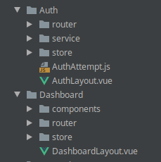

# Modules

The modules have the base resources to render the structure that will be used to assemble all of their child screens. For that, components will be configured to make the presentation, routes, state managers and etc. The application already has two modules created: Auth and Dashboard.



## Auth Module

This module is intended to support the screens that are accessed without having a defined session. We are talking about screens like the one used to enter a username and password to start a session, the one used to create a user or to change the password that was lost. In this case we would add everything that was the basis for these screens and then we would proceed with the construction of its`Services`, `Schema` and`Views`. Initially it has the folders below, but it can be changed freely in order to implement all the resources that the project requires.

### store

It only manages two states:`token` and`user`. The user state is explored with`getters`to compose information from the screens of other modules, for example.

### helper

It has functions that are used to validate permission and allow access to resources such as routes and menus.

### router

It has only the login screen route, but it can be increased to accommodate the resources that are created to manage the access of the user who does not have a session.

## Dashboard Module

The resources needed to configure the control panel, which is the protected area of the application, will remain in this module. It has the following folders:

### store

Manage`transition`, `report`, `title` that are related to the interface.

### router

It integrates all the domain routes that are used to create screens for the module.

### components

It has components to render the upper right menu and the left side menu \(drawer\).

## Creating a new module

There is no exact standard for creating a module. It will probably have at least one component to render the screen and a set of routes to make loading possible. An entry in the state manager may also be required.

### Routes

To register your module's routes, simply create a`routeFile`that exports a function that receives the`router`as an argument, import it into`src/router/index.js` and add a line to execute this function there. Within`routeFile`it is possible to add`routes` and `middlewares`.


```javascript
// ...
import myModuleRouteFile from 'src/modules/MyModule/router/routeFile'
// ...

  // create router
  $router = new AppRouter(options)

  // ...

  // inject router on auth module
  authRouteFile($router)
  // inject router on dashboard module
  dashboardRouteFile($router)
  // inject router on MyModule module
  myModuleRouteFile($router)
```


### State Management

To register a`store` that has been created by the module, just go to the main`store`in `src/store/index.js`, import and register as a module.


```javascript
// ...
import myModule from 'src/modules/MyModule/store'
// ...

  // create store
  $store = new Vuex.Store({
    modules: {
      app,
      auth, // register auth router
      dashboard, // register dashboard router
      myModule // register the new module MyModule
    },
    // enable strict mode (adds overhead!)
    // for dev mode only
    strict: process.env.DEV
  })
```


