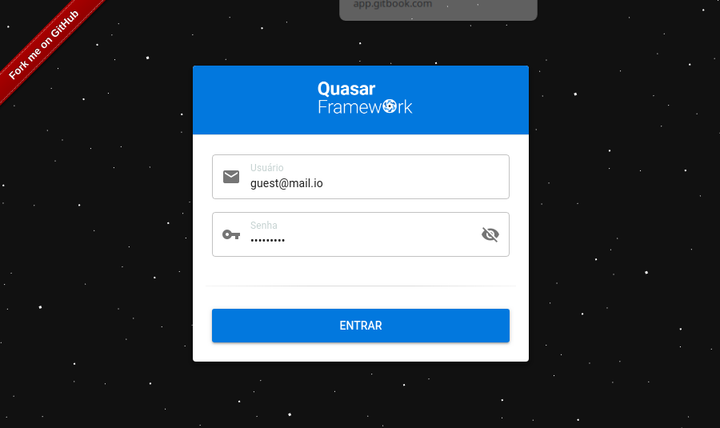
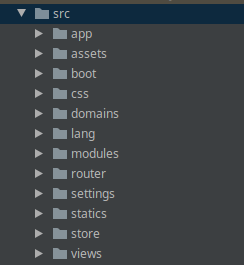

# Domains

Domain is a complicated term to explain. Trying to see the meaning of the word in our language we will have something that is not very appropriate for computers.

When we do the same research in English the results change and we start to get closer to what is expected for computing

The above definition "`a specified sphere of activity or knowledge`" is what I will use as a reference to explain the purpose of the`domain`folder. If you happen to have heard of Domain Driven Design \(DDD\) you will also have a hand in understanding the term.

The project treats domains as a group of resources that make sense to be grouped together. There is no physical need to be together, but there is a certain familiarity between them. What is in each domain is usually coined as an`entity`. So let's group our entities into domains to map our business rules, states and behaviors. The representation of entities in the applied methodology is the[`schema`](schema.md). Right inside the domains folder, we will have`schemes` and `services` available to the components. Some support resources for them will also be available there as route and internationalization files, but his focus is to group what we will call`business rules` \(`behaviours` & `states`\).

