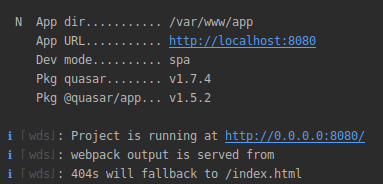
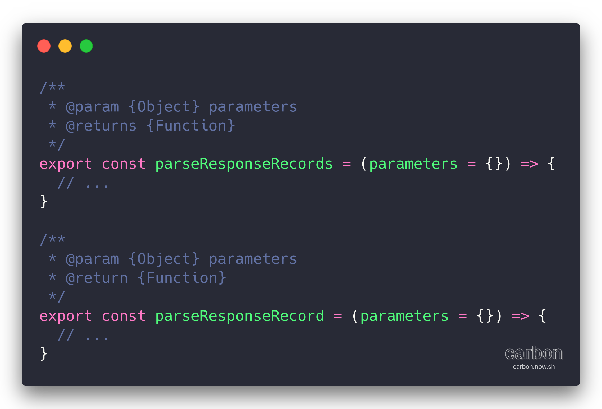

# Services

## Services Structure

In the`app/` folder there are a series of documents that are preconfigured and ready to be extended. Among these we have some that are intended for the creation of our services.

If the`service`in question is not going to answer a`CRUD`it is possible to extend only from`Http`and have access only to the methods referring to`HTTP`verbs.

A service created to solve basic operations will extend from`Rest`and will have a syntax similar to the image below.

### `Http`

The Http class is the basis for Rest and is an abstraction of an HTTP client. By default it will use the`axios`that is created in`src/settings/http.js`, which uses the value of the`.env VUE_APP_REST_BASE_URL` entry as`baseURL`.

### `Rest`

To supply the 4 pillars of the management of the entities, it already has the`create`, `read`, `update` and `destroy` methods, as well as the`search`/`paginate` paginate method to deal with data search and pagination.


to adapt to the different APIs there are two functions in`src/settings/rest.js`that can be adapted to extract the data from the request response and pass to the format that the project expects


