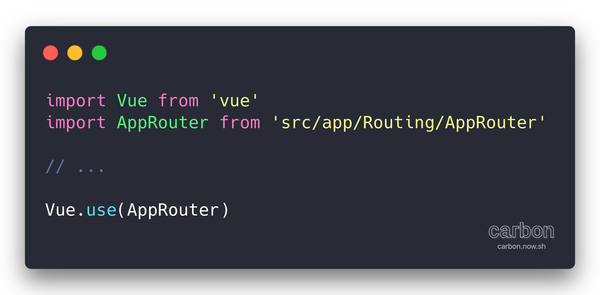

# Routes

In`src/router/index.js` is the creation of the application router. There are some details slightly different from the standard that the [Quasar](https://quasar.dev) template delivers. We will see one about these differences below.

## Using AppRouter

From the beginning of`index.js` you can see that there is an import for a file called`AppRouter`. This will be seen in a section similar to the section below.

This file is a class that extends`VueRouter`allowing to modify, improve and add behaviors to the router.

## Router Injection

In addition to configuring two base`middleware`, there is also the configuration of the routes. This configuration is done in a different way, instead of "pulling" the routes and adding them as an argument in the construction of the`router`functions are imported \(also called`RouteFile`\) that receive the $ router as an argument so that each module is responsible for add your routes.

This change allows the modules to have more independence over the configurations they can make in the project. So, instead of having just one`beforeEach`, for example, we will have several`middleware`of this type distributed by the project.

## Auth `RouteFile`

The`RouteFile` of the Auth`module`is located in`src/modules/Auth/router/routeFile.js` and is very simple, with only one route. As mentioned earlier, it receives the router as a parameter and uses the`addRoutes`method to add the routes. In this case, helpers`route` and `group` are being used to create the routes. These functions build objects compatible with [RouteConfig](https://router.vuejs.org/api/#routes) which are the traditional route structures.

## Dashboard `RouteFile`

Allocated in`src/modules/Dashboard/router/routeFile.js` the`Dashboard`route composition will be much more extensive than that of`Auth`. This`module`will house the entire "control panel", so instead of defining all routes in it, imports of other route files are made. The other routes are close to the Schema domain and must always export arrays. In order to access the resources that will be created, it will be necessary to register the routes that we create in this file, so it will be remembered later.

## Route Files

A route file simply needs to export a function that returns an array of routes like the image below.

### Creating CRUD Routes

When creating a large number of screens, it is common to repeat several sections and configurations several times. To speed up the creation it is possible to use some helpers to create routes for CRUD, as can be seen in the example below.

This section above creates a set of 5 properly configured routes. To use some resources that are preconfigured in the project, it is necessary to configure some details in the route meta. The`crud`function already solves this and introduces the`scope`and`namespace`in the route [`meta`](https://router.vuejs.org/guide/advanced/meta.html), allowing additional configurations to be passed. The following example is an excerpt from the [`src/app/Util/routing.js`](https://github.com/quasarframeworkbrasil/skeleton/blob/master/src/app/Util/routing.js#L53).

