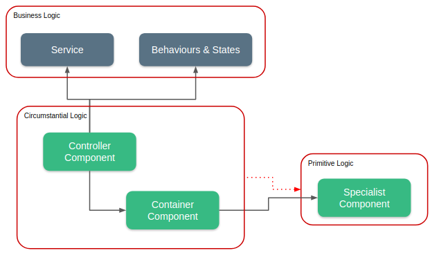

# Concepts

The Skeleton idea is to deliver a RAD \(Rapid Application Development\) experience by centralizing routine operations and leaving the business rules to the developer. Acting only on business logic, the developer works on configuring the states and behaviors that will be displayed on the screen. Then it creates a`Controller Component` that will pass these settings on to the`Container Component`. This in turn will communicate with the`Specialist Components` to render the screens.

## When is it interesting to use this methodology?

For our studies and experiences the methodology used in the construction of the Skeleton tends to be more efficient in applications that are control panels with many, many screens with the same structure. The cost of creating a`Container Component` is relatively high and if the application has very different screens in each environment, it is not worth the investment. On the other hand, if the application has dozens of forms and tables in the standard that is already supported, productivity will be absurdly high.

## Will my project get more complex?

The straight answer is YES. On the other hand, there are some benefits such as:

* Simplification of the production chain \(it is not necessary to rewrite the entire logic of state management, validation, etc.\);
* Centralization of changes, if the Quasar \(framework that can be replaced with some reduced effort\) undergoes some modification, your code will not be impacted, only the adapters that apply your settings to its components;
* Possibility to create base structures that are repeated frequently;
* Project control over a programming language and not over templates or vital dependency on a UI framework.

## Does using this methodology hamper my project?

Absolutely not. It is possible to see in [Customizando Components](customizacao/customizando-components.md) that we can create customized components, in [Customizando Views](customizacao/customizando-views.md) we can see how to create fully customized views without even making use of the domain structure.

## How can I get support?

We are using our group on [Telegram](https://t.me/quasarframeworkbrasil) and the  [issues](https://github.com/quasarframeworkbrasil/skeleton/issues) in the Skeleton repository to answer questions and welcome criticisms / suggestions.

`--`

> Let's start coding ?!



